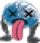

# live-to-die

## git pages -> https://streanger.github.io/live-to-die/

Game for challenge, not finished on time :(

Goals:

  - create five rounds and six text scenes
  
  - the action takes place in space
  
  - you are controlling some kind of robot/monster
  
  - you need to take something from ship and escape at the end
  
  - outside the ship, the war is going on(you can see it from the windows)
  
# Dead monster. His face refers to the poor game quality.

# Probably won't be finished. More materials will be uploaded here.
